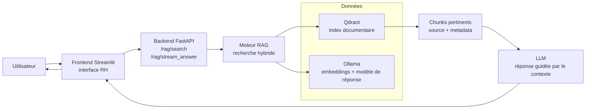

# Chatbot RH

Chatbot orienté Ressources Humaines, basé sur une architecture RAG (Retrieval-Augmented Generation) pour répondre à des questions sur des politiques internes, accords d'entreprise, règles de télétravail, congés, forfait jours, etc.

Le projet associe :
- un frontend Streamlit pour l'interaction avec l'utilisateur,
- un backend FastAPI exposant des endpoints de recherche et de génération,
- un moteur de recherche hybride basé sur Qdrant + BM25,
- des modèles locaux Ollama pour les embeddings et les réponses LLM,
- une base documentaire indexée pour retrouver les bons extraits avant de répondre.

## Vue d'ensemble

Le chatbot est conçu pour répondre à des questions qui doivent être justifiées par des documents internes ou réglementaires. Il ne répond pas "à l'aveugle" : il cherche d'abord des extraits pertinents dans une collection Qdrant, puis construit une réponse à partir de ces éléments.

Cette logique permet :
- d'améliorer la fiabilité des réponses,
- de citer les sources documentaires retrouvées,
- de rester compatible avec des modèles LLM locaux via Ollama,
- de faire évoluer facilement le corpus documentaire sans toucher l'interface.

## Fonctionnalités

- Interface de chat Streamlit dédiée au RH
- Recherche hybride vectorielle + lexicale
- Reformulation de requêtes et expansion de requêtes optionnelles
- Filtre par date de document
- Accès aux collections Qdrant et inspection des dates disponibles
- Liste des modèles Ollama disponibles
- Streaming de la réponse du modèle
- Sélection de collections selon un rôle métier (registry Qdrant)
- Support Docker pour exécution simplifiée

## Architecture

### Frontend
Le frontend est une application Streamlit :
- `frontend/main.py` : point d'entrée de l'interface
- `frontend/pages/` : pages de chat, configuration et tests
- `frontend/chatbot_utils/` : composants UI du chatbot
- `frontend/utility/` : gestion du state et paramètres de session

### Backend
Le backend est une API FastAPI :
- `backend/main.py` : initialisation de l'application
- `backend/routers/` : endpoints de recherche, rewriting et génération
- `backend/engines/rag_engine.py` : moteur de retrieval et de génération
- `backend/services/` : clients et services externes (Ollama)
- `backend/core/config.py` : configuration globale

### Data layer
- Qdrant : base vectorielle pour indexer les chunks de documents
- Ollama : modèles de génération et d'embedding
- Documents sources : PDF, documents internes, lexiques, etc., chargés dans les collections Qdrant

## Flux de données et interactions

Le schéma ci-dessous illustre le parcours principal d'une question utilisateur dans le système RAG :



Ce diagramme montre que la question est d'abord traitée par le frontend, transmise au backend, puis enrichie par une recherche documentaire avant la génération de la réponse finale.

## Structure du projet

```text
RH_chatbot/
├── backend/
│   ├── core/
│   ├── engines/
│   ├── routers/
│   ├── services/
│   ├── Dockerfile
│   ├── main.py
│   ├── mots_cle.py
│   ├── requirements_backend.txt
│   └── tiktoken_cache/
├── frontend/
│   ├── chatbot_utils/
│   ├── pages/
│   ├── plugins/
│   ├── ressource/
│   ├── utility/
│   ├── CHANGELOG.md
│   ├── Dockerfile
│   ├── main.py
│   ├── mots_cle.py
│   └── requirements_frontend.txt
├── docker-compose.yml
├── question.md
├── .gitignore
└── README.md
```

## Prérequis

Avant de lancer le projet, il faut avoir :
- Python 3.10+
- Docker et Docker Compose
- Un serveur Ollama accessible localement ou via réseau
- Une instance Qdrant accessible
- (Optionnel mais recommandé) NVIDIA GPU si vous souhaitez utiliser des modèles lourds sur l'inférence locale

## Variables d'environnement

Le projet lit plusieurs variables d'environnement.

### Backend
Les plus importantes sont :

```bash
OLLAMA_HOST=http://localhost:11434
QDRANT_HOST=localhost
QDRANT_PORT=6333
EMBEDDING_MODEL=embeddinggemma:latest
CONTEXT_SIZE=22000
CHATBOT_ROLE=RH
```

### Frontend
```bash
API_URL=http://backend:8000
DEFAULT_LLM=gemma4:e4b
DEFAULT_VLM=gemma4:e4b
IS_DEV=yes
STREAMLIT_SERVER_MAX_UPLOAD_SIZE=5000
```

## Lancement rapide via Docker

Le projet est déjà prêt pour un lancement via `docker-compose.yml`.

```bash
docker compose up --build
```

Cela démarre :
- le backend sur `http://localhost:8002`
- le frontend sur `http://localhost:8503`

La configuration de `docker-compose.yml` attend aussi un réseau Docker externe nommé `qdrant_net` pour la communication avec Qdrant.

## Lancement en local

### 1) Installer les dépendances backend

```bash
cd backend
python -m venv .venv
source .venv/bin/activate
pip install -r requirements_backend.txt
```

### 2) Installer les dépendances frontend

```bash
cd frontend
python -m venv .venv
source .venv/bin/activate
pip install -r requirements_frontend.txt
```

### 3) Démarrer Ollama

Assurez-vous qu'Ollama tourne et qu'au moins les modèles suivants soient disponibles :
- un modèle de génération (par exemple `gemma4:e4b`)
- un modèle d'embedding (par exemple `embeddinggemma:latest`)

Exemple :

```bash
ollama pull gemma4:e4b
ollama pull embeddinggemma:latest
```

### 4) Démarrer Qdrant

Vous pouvez utiliser une instance locale ou un service Docker.

```bash
docker run -d --name qdrant -p 6333:6333 qdrant/qdrant
```

### 5) Démarrer le backend

```bash
cd backend
export OLLAMA_HOST=http://localhost:11434
export QDRANT_HOST=localhost
export QDRANT_PORT=6333
export EMBEDDING_MODEL=embeddinggemma:latest
export CONTEXT_SIZE=22000
export CHATBOT_ROLE=RH
uvicorn main:app --host 0.0.0.0 --port 8000 --reload
```

### 6) Démarrer le frontend

```bash
cd frontend
export API_URL=http://localhost:8000
export DEFAULT_LLM=gemma4:e4b
export IS_DEV=yes
streamlit run main.py --server.port 8501 --server.address 0.0.0.0
```

Ensuite ouvrez :
- frontend : `http://localhost:8501`
- backend API : `http://localhost:8000/docs`

## API backend

Le backend expose plusieurs routes de type RAG.

### Collections Qdrant
- `GET /rag/collections_qdrant`
- `GET /rag/collections/{collection_name}/dates`
- `GET /rag/collections/{collection_name}/random`

### Modèles disponibles
- `GET /rag/models`

### Recherche
- `POST /rag/search`

Payload attendu :
```json
{
  "collection_name": "nom_collection",
  "query": "Quelle est la politique de télétravail ?",
  "model": "gemma4:e4b",
  "context_size": 22000,
  "n_results": 5,
  "seuil": 0.5,
  "alpha": 0.5,
  "use_hyde": false,
  "use_expansion": false,
  "doc_date_filter": ""
}
```

### Reformulation de requête
- `POST /rag/rewrite`

### Réponse streamée
- `POST /rag/stream_answer`

## RAG et moteur de recherche

Le moteur de recherche principal est documenté dans `backend/engines/rag_engine.py`.

Il combine :
- une recherche vectorielle via Qdrant,
- une recherche lexicale via BM25,
- une pondération hybride (`alpha`)
- une reformulation / expansion de la question selon les paramètres
- un filtrage facultatif par date de document

L'idée est de récupérer les chunks les plus pertinents puis de construire une réponse en respectant le contexte documentaire fourni.

## Sécurité et contraintes de réponse

Le système suit un principe strict :
- il n'invente pas,
- il répond uniquement sur base du contexte disponible,
- s'il ne trouve pas l'information, il indique clairement que l'élément n'est pas présent dans les documents.

La configuration dans `backend/core/config.py` impose également :
- réponse en français,
- priorisation des documents les plus récents,
- référence explicite aux dates des documents dans le contexte.

## Test du système

Un fichier `question.md` contient des questions de test et des réponses attendues sur des thèmes RH, notamment :
- forfait jours,
- télétravail,
- compte épargne temps,
- restauration / frais de repas,
- obligations et droits du salarié.

Ces questions peuvent servir de base pour validier la qualité de la recherche et la cohérence des réponses produites.

## Déploiement

Le dépôt est pensé pour être exécuté soit :
- localement pour le développement,
- via Docker Compose pour une mise en production légère ou de démonstration.

Pour un environnement de production plus robuste, il faudra prévoir :
- un volume persistant pour Qdrant,
- un stockage durable pour le corpus documentaire,
- des modèles Ollama adaptés à la charge,
- une surveillance de la santé des services,
- un mécanisme de gestion des accès et de traçabilité.

## Bonnes pratiques

- Préparer un corpus documentaire propre et homogène avant l'indexation.
- Vérifier la qualité des chunks et des métadonnées (source, page, date).
- Surveiller la qualité des résultats par date et par pertinence.
- Ajuster les modèles selon les besoins métier et la qualité attendue.
- Tester régulièrement les cas limites et les questions hors contexte.


## Remarque

Le projet intègre des éléments spécifiques à un contexte RH interne, avec des politiques et des références documentaires qui peuvent varier selon l'organisation. Le système doit donc être alimenté par les bons documents de référence pour rester fidèle au cadre de l'entreprise.
